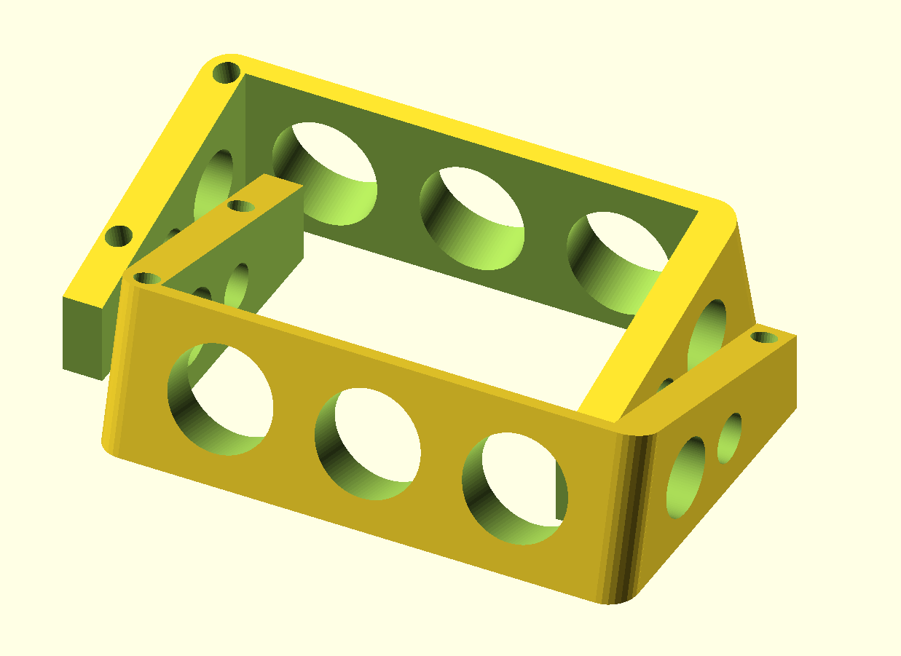

# ergodox-tent

A tent for the [Ergodox acrylic case designed by Litster](http://deskthority.net/wiki/ErgoDox). This a fork of adereth's [ergodox-tent](https://github.com/adereth/ergodox-tent), that offers a major reduction in materials.

## Usage

If you're just interested in printing your own, just download [tent.stl](tent.stl) and feed it into your favorite software for 3D printing.

## License

All source is distributed under the Eclipse Public License either version 1.0 or (at
your option) any later version.

The tent design and all images are released under the [Creative Commons Attribution-ShareAlike 4.0 International License (CC BY-SA 4.0)](http://creativecommons.org/licenses/by-sa/4.0/)
